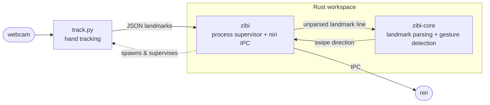

<h1 align="center">
  Zibi
  
</h1>

<p align="center">
  Control your <a href="https://github.com/YaLTeR/niri">niri</a> Wayland session with hand gestures — no keyboard, no mouse, just your webcam.
</p>

---

## Table of contents

- [Overview](#overview)
- [Requirements](#requirements)
- [Installation](#installation)
- [Quickstart](#quickstart)
- [Configuration](#configuration)
- [Troubleshooting](#troubleshooting)
- [Development](#development)
- [Accessibility](#accessibility)
- [License](#license)

---

## Overview

**Zibi** turns your webcam into a touch-free controller for the [niri](https://github.com/YaLTeR/niri)
scrollable-tiling Wayland compositor. You wave your hand in front of the camera and Zibi translates
that motion into niri actions — swipe to move between workspaces and columns without touching an input
device.

It is built as a small two-stage pipeline, with `zibi` as the single entry point that launches and
supervises the tracker:



- **`track.py`** — a Python tracker built on [MediaPipe](https://developers.google.com/mediapipe) and
  OpenCV. It detects your hand(s) and, for each one, streams a JSON record — the hand label and all 21
  landmark points — to stdout, one record per line.
- **`zibi`** — a Rust program that **spawns the tracker as a child process**, reads those landmark
  records from the child's stdout, takes the index-fingertip point, detects swipe direction, and drives
  niri over its IPC socket. When the tracker stream ends, `zibi` shuts the child down and exits. You no
  longer pipe the two together by hand — running `zibi` starts the whole pipeline.

Current gesture mapping:

| Gesture       | niri action           |
| ------------- | --------------------- |
| Swipe up      | Focus workspace up    |
| Swipe down    | Focus workspace down  |
| Swipe left    | Focus column left     |
| Swipe right   | Focus column right    |

### Who it's for

- niri users who want a hands-free way to navigate their workspaces.
- Anyone exploring camera-based, touch-free interaction as an alternative to keyboard/mouse input.

### Demo

https://github.com/user-attachments/assets/0fd2be83-55da-428a-986b-b8679de8f2a8

---

## Requirements

- **Wayland session running [niri](https://github.com/YaLTeR/niri)** — Zibi talks to niri over its IPC
  socket, so it only works inside a running niri instance.
- **A webcam** exposed as a V4L2 device (e.g. `/dev/video0`).
- **System libraries** for the tracker and its GUI preview: OpenGL, a working V4L2 backend, and the
  usual GTK/X libraries that OpenCV and MediaPipe pull in. On most desktop Linux installs these are
  already present.
- To build from source:
  - **Rust** (2024 edition toolchain — install via [rustup](https://rustup.rs)).
  - **Python 3.12+** with `pip`.

---

## Installation

### AppImage (recommended)

Grab the latest `*-zibi-x86_64.AppImage` from the
[Releases](https://github.com/IdanKoblik/zibi/releases) page. The AppImage bundles both the Rust
binary and the Python tracker (including the MediaPipe model), and its `AppRun` wires the pipeline up
for you:

```bash
chmod +x zibi-x86_64.AppImage
./zibi-x86_64.AppImage
```

### Building from source

Clone the repo and install the two toolchains' dependencies:

```bash
git clone https://github.com/IdanKoblik/zibi.git
cd zibi

# Rust side
cargo build --release          # produces target/release/zibi

# Python side
python -m venv .venv
source .venv/bin/activate
pip install -r requirements.txt
```

`requirements.txt` pulls in `opencv-python`, `mediapipe`, and `pyinstaller`. The hand-tracking model
ships in `models/hand_landmarker.task`.

To reproduce the packaged AppImage locally (requires
[`appimagetool`](https://github.com/AppImage/appimagetool)):

```bash
bash packaging/build_appimage.sh
```

---

## Quickstart

The quickest way to try Zibi is to download the latest
`*-zibi-x86_64.AppImage` from the [Releases](https://github.com/IdanKoblik/zibi/releases) page and run
it — it bundles the tracker, the model, and the binary, and starts the whole pipeline for you:

```bash
chmod +x zibi-x86_64.AppImage
./zibi-x86_64.AppImage
```

From a source checkout, run `zibi` and let it spawn the tracker for you, with niri running and your
webcam connected. By default `zibi` looks for a `track` binary next to its own executable; from a
source build there isn't one, so point it at the Python tracker with the `ZIBI_TRACK_CMD` environment
variable:

```bash
# with the venv active
ZIBI_TRACK_CMD="python track.py" ./target/release/zibi
```

The tracker opens a preview window showing the tracked hand skeleton and the fingertip coordinates,
then streams JSON landmark records into `zibi`.

**Test a gesture:** with your dominant hand visible in the preview, make a deliberate swipe — e.g.
move left-to-right across the frame. Zibi should focus the column to the right in niri. Try up/down to
move between workspaces. Press `q` in the preview window to stop the tracker.

If nothing happens, see [Troubleshooting](#troubleshooting).

---

## Configuration

On first run `zibi` writes a default config to `~/.config/zibi/config.toml` and reads it on every
subsequent launch:

```toml
[core]
move_threshold = 150       # minimum pixel movement to register a swipe
dominant_hand = "Right"    # "Left" or "Right"
camera = "/dev/video0"     # webcam device path
```

- **`move_threshold`** — how far (in pixels) your fingertip must travel within the detection window
  before a swipe is registered. Lower it for a more sensitive setup, raise it to avoid accidental
  triggers.
- **`dominant_hand`** — which hand Zibi should track.
- **`camera`** — the webcam device to capture from.

Gesture timing is currently fixed in the binary: motion is evaluated over a **300 ms** window, with a
**500 ms** cooldown after each recognized swipe to avoid double-firing.

### Environment variables

- **`ZIBI_TRACK_CMD`** — the command `zibi` runs to launch the tracker. When unset, `zibi` executes a
  `track` binary located next to its own executable (this is how the AppImage bundle is wired). Set it
  to run the tracker a different way — for example `ZIBI_TRACK_CMD="python track.py"` when working from
  a source checkout.

> **Note:** `camera` is now passed through to the tracker (via a `--camera` argument), so it selects
> the capture device. `dominant_hand` is parsed but not yet wired into the runtime — the tracker
> reports every hand it detects rather than filtering to your dominant one. See
> [Known limitations](#known-limitations).

---

## Troubleshooting

### Debug logging

`zibi` logs to both stdout and a timestamped file under:

```
~/.local/share/zibi/zibi.<YYYY-MM-DD_HH-MM-SS>.log
```

The log records the niri socket connection, the config path in use, and every detected direction —
tail it while you gesture to see whether swipes are being recognized:

```bash
tail -f ~/.local/share/zibi/zibi.*.log
```

### Common issues

- **"Cannot connect to niri socket"** — Zibi must run inside a live niri session. Confirm niri is your
  current compositor and that `$NIRI_SOCKET` is set.
- **No coordinates / preview stays blank** — check the webcam is free and readable (nothing else is
  holding `/dev/video0`) and that your hand is well lit and fully in frame.
- **Swipes never trigger** — your motion may be under `move_threshold`; lower it in the config, or make
  larger, faster swipes.
- **"Invalid hand tracking task"** — the tracker verifies the SHA-256 of `models/hand_landmarker.task`
  on startup and exits if it doesn't match. Re-fetch the bundled model file (or use the AppImage, which
  ships a known-good copy).

### Known limitations

- Works only with the **niri** compositor.
- The gesture → action mapping is **fixed** (no user-defined bindings yet).
- The `dominant_hand` config value is **not yet wired up** — the tracker reports any hand it sees rather
  than filtering to your dominant one.
- The tracker detects up to **two hands**, but `zibi` still derives a single swipe from the
  index-fingertip landmark; there are no two-handed gestures.

---

## Development

### Building & running

```bash
cargo build              # debug build
cargo build --release    # optimized build

# run the full pipeline (zibi spawns the tracker itself)
ZIBI_TRACK_CMD="python track.py" cargo run
```

### Tests

The gesture-detection and coordinate-parsing logic lives in `zibi-core` and is unit-tested:

```bash
cargo test --all
```

### Formatting & linting

The project enforces `rustfmt` and `clippy`. A repo pre-commit hook (`.githooks/pre-commit`) checks
formatting before each commit — enable it with:

```bash
git config core.hooksPath .githooks
```

CI (`.github/workflows/ci.yml`) runs the same checks on every push and pull request:

```bash
cargo test --all --locked
cargo fmt --all -- --check
cargo clippy --all-targets --all-features --locked -- -D warnings
```

---

## Accessibility

Zibi exists to make computer control possible **without touching a keyboard or mouse** — using only
hand motion in front of a webcam. If you rely on touch-free input and have feedback, unmet needs, or
run into barriers using Zibi, please reach out by opening an issue on the
[issue tracker](https://github.com/IdanKoblik/zibi/issues). Accessibility reports and feature requests
are treated as first-class.

---

## License

Zibi is released under the [MIT License](LICENSE).
